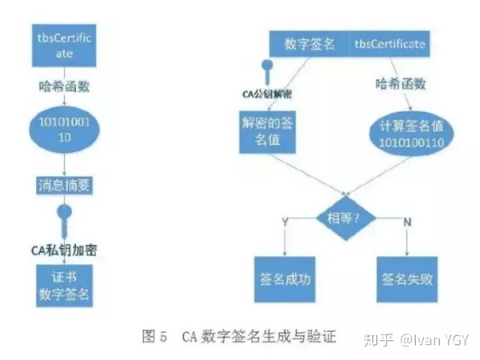
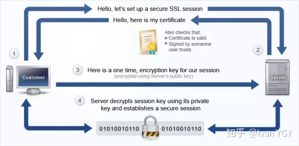
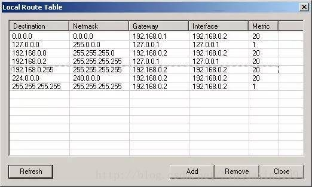
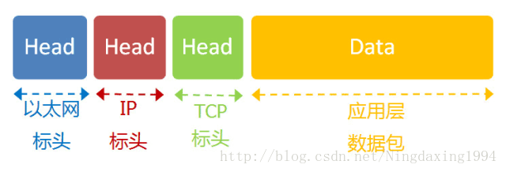
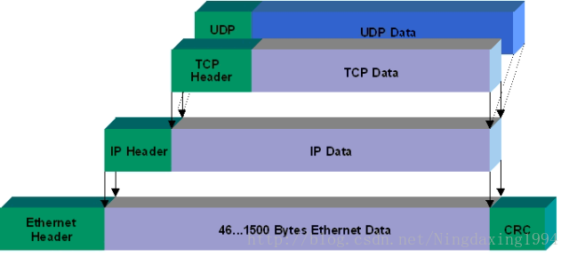
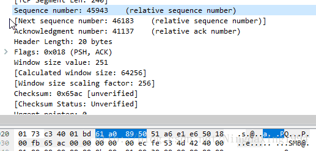
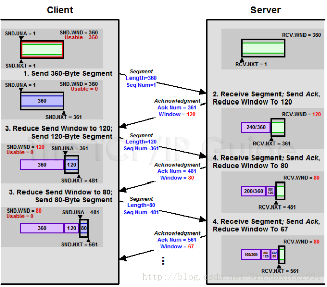
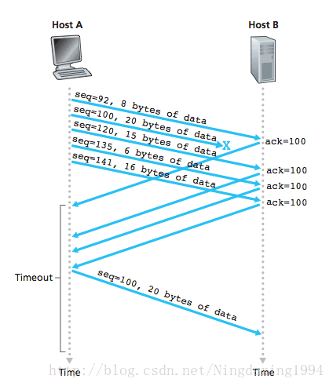

sass_program


----------------------------------
by 2019/3/1 09::40
----------------------------------
emmmmm 项目已经一期做完了，二期做了一半吧，自我感觉我的业务代码写了有这个项目的1/4到1/3之间吧（项目组总共有9个人= =），代码量差不多有30k了，还是很心累的；从一开始的框架搭建到nodejs（express）的引入再到前端vue-router的权限管理，自我感觉已经做的挺不错了。后面就写写比如vuex、es6概念方面的理解吧，不能只知道用，还是要熟悉一些属性、方法什么的。  


by 2018/4/8 11:00
----------------------------------
emmmmm 今年2月1号开始的安全SASS云项目在上个月（3月31号）也结束第一次的发布会检查，总体上来说还是挺不错的吧，2个月的时间前端部分完成了95%，和后台的联调完成的不多，大概也就70%吧= =实在是页面太多了，一个完整的SASS云项目为了达到发布会的要求，从没有成熟的UI设计和业务实现逻辑到各功能模块的实现用了大概一个半月的时间，后面花了半个月左右的时间联调。总的页面总共加起来数量大概有将近100各左右，我负责了大概其中的20个页面吧：包含LB、NAT、用户信息等等的主页、配置页和详情页，31号晚上提交代码后闲下来无聊数了一下前前后后业务代码、封装模块组件的代码差不多有个1w行吧T T虽然这中间加班了很多次，也有发布会前一晚通宵，但还是有很多收获的吧 :)

这次项目用的主要是VUE框架基于webpack、es6和node开发的环境，其中为了快速开发吧，用了一些iview的组件，自己也在iview提供的基础组件的基础上封装了几个功能性更强的组件。对于这次项目的总结我会每天写一点，当做记录吧，项目结束我会整理成几篇博文放到我的博客去。

## 代码托管
基于gitLab的代码版本管理，简单的写下流程吧
1. git clone 项目远程主机路径/git clone -b 具体分支 项目远程主机；会有一个默认的remote叫做origin
2. git remote add xxx（自己的远程主机名） 远程主机路径
3. git push xxx 本地分支名称:远程分支名称（没有分支名称时自动创建）
4. git fetch origin / git merge origin 分支名


## 1.路由（router）	
在说项目路由前，可以先看看vue官方给出的[vue-router](https://router.vuejs.org/zh-cn/essentials/getting-started.html)的介绍，我也会列出一些稍微需要注意的点：
### 1.动态路由参数
用于不同ID的用户都需使用同一个组件渲染
```javascript
const User = {
  template: '<div>User</div>'
}

const router = new VueRouter({
  routes: [
    // 动态路径参数 以冒号开头
    { path: '/user/:id', component: User }
  ]
})
```
> 像 /user/foo 和 /user/bar 都将映射到相同的路由。一个『路径参数』使用冒号 : 标记。当匹配到一个路由时，参数值会被设置到 this.$route.params，可以在每个组件内使用。其中params靠this.$router.push(name or path, params: {id: xx})方法传递，也可以多段设置路由参数：模式:/user/: username/post/:post_id => 匹配路径: /user/evan/post/123 => $route.params: { username: 'evan', post_id: 123 }
### 2.结合项目
这次采用的是分级的路由定义方式：
```javascript
import childRouter from '../../router'
const parentPouter1 = {
	path:
	name:
	title:
	component:
	children: childRouter
}
const routerConfig = [ parentPouter1 ]
export default const router = new VueRouter({
	routes: routerConfig
})
// 再在childRouter里面分级定义子路由：
[
	{
		path:
		name:
		title:
		component: () => import('url') //具体页面的路径
	},
	{
		path:
		name:
		title:
		component: () => import('url') //具体页面的路径
	}
]
```

对于手风琴类的父级展开式的多个子路由的情况：
```javascript
const parentPouter2 = [
	{
		path:
		name:
		title:
		component:
		children: childRouter1
	},
	{
		path:
		name:
		title:
		component:
		children: childRouter2
	}
]
const routerConfig = [ 
	parentRouter1,
	...parentPouter2  //...分构数组成对象形式的路由
]
export default const router = new VueRouter({
	routes: routerConfig
})
```
具体关于项目路由结构可以看第6项介绍。

## 2.封装组件
在三月中旬开发的时候，被要求在主要业务的主页上添加一个详情的可收缩的弹框。需求很简单，但为了统一样式便于开发，采取了单独封装组件的方式。其中为了保证详情框和主页面内容高度一致，用到CSS变量的知识点（具体内容可以阅读[阮一峰CSS变量教程](http://www.ruanyifeng.com/blog/2017/05/css-variables.html)）。
```javascript
<script type='text/javascript'>
	mounted () {
		document.body.style.setProperty('--autoHeight', $(#leftId).height()) // 取到左边内容高度再设置autoHeight变量的大小
	}
</script>
<style type='text/css' scoped>
	body {
		--autoHeught: 25; /*这个高度是随便定的，表示类型即可*/
	}
	.card {
		height: calc(var(--autoHeight)*1px); //var()函数是取css变量的值；calc()函数连接数值和单位
	}
</style>
```

## 3.数据传递
VUE框架中可以用动态路由在不同页面间传递数据，常用的传递参数的方法是通过params和query，注意的是：由于动态路由也是传递params的，所以在 this.$router.push() 方法中path不能和params一起使用，否则params将无效。需要用name来指定页面

### 1.params
```javascript
this.$router.push({name:'RouterName', params:{data: this.userID}}) //其中name参数是下一跳路由的name属性

// 在目的页面使用传递过来的params里的data值
this.$route.params.data
```

### 2.query
```javascript
this.$router.push({name:'RouterName', query:{data: this.userID}}) //其中name参数是跳转路由的name属性
// 或者
this.$router.push({path:'RouterPath', query:{data: this.userID}}) //其中path参数是下一跳路由的path属性

// 在目的页面使用传递过来的query里的data值
this.$route.query.data
```
这两种传递参数的方法区别主要在于：params传递的参数不会体现在页面的URL里，刷新页面后数据就会消失；query传递的参数会以"?userID=xxx"的后缀方式体现在URL中，刷新页面数据还会保留。

## 4.父子组件通信
在单个页面里的组件间的通信，例如打开新建或编辑框时的数据传递；这里只考虑父子组件间的通信，非父子组件通信通过创建事件中心的方式暂不深究。


### 1.父组件传递数据给子组件
主要通过props属性实现：
```javascript
//父组件
<parent>
	<child :childprops='this.data'><child>
</parent>

<script>
	data () {
		return {
			data: 'mclean'
		}
	}
</script>

//子组件
props: ['childprops']
//或者
props: {
    childprops: String // 这样可以指定传入的类型，如果类型不对，会警告
}
//再者
props: {
    childprops: {
        type: Array,
        default: 'yuhui' // 这样可以指定默认的值
    }
}
```
子组件注册一个属性（props）childprops，父组件中对这个属性绑定值，子组件可以直接this.childprops调用父组件传过来的数据。

### 2.子组件向父组件传递
子组件想要改变数据这在VUE里面是不允许的，因为VUE只允许单向数据传递，我们可以通过触发事件来通知父组件改变数据，从而达到改变子组件数据的目的，即拿到子组件传过来的数据。
```javascript
//子组件
<template>
	<button @click='buttonClick'>click</button>
</template>

<script>
	methods: {
		buttonClick () {
			this.$emit('childMethod', childData); // 触发childMethod,传递参数childData
		}
	}
</script>

//父组件
<parent>
	<child v-on:childMethod='parentMethod'></child>
</parent>

<script>
	methods: {
		parentMethod (data) {
			// 参数data即子组件传递的childData
		}
	}
</script>
```
this.$emit()监听触发childMethod方法，通知父组件执行parentMethod方法,并拿到参数。

## 	5.状态管理
针对这次项目，有个直观的感受就是：数据在组件间通信比较频繁的情况下，通常用的父子组件、兄弟组件通信方式就会显得异常繁琐，而且不便于管理。
从VUE一个简单的状态自管理应用来看：
```javascript
new Vue({
  // state
  data () {
    return {
      count: 0
    }
  },
  // view
  template:
    <div>{{ count }}</div>

  // actions
  methods: {
    increment () {
      this.count++
    }
  }
})
```
这个状态自管理应用包含以下几个部分：

* state：驱动应用的数据源；
* view：以声明方式将state映射到视图；
* actions：响应在 view上的用户输入导致的状态变化。

这是一个普通的组件从样式渲染到数据绑定再到数据变化，单一的状态比较清晰，遇到多个组件共享状态时，这种简洁性很容易被破坏且难以管理。因此，把组件的共享状态抽出来，以一个全局单例模式管理，这就是VUEX背后的基本思想。


后续用完之后再来写: )

## 6.项目结构
这部分应该是在刚开始写的，但忘了= =，现在补上吧。
在说这次项目之前先说基于vue-cli搭建的项目结构各个文件的作用，我就从csdn上找了篇文章（[点击此处](https://blog.csdn.net/qq_34543438/article/details/72868546?locationNum=3&fps=1)）。光看这些个概念可能有点抽象，结合这次项目我用自己的理解解释一下；这次用的是嵌套显示，主要通过路由里的children属性设置，具体配置如下：
### 1.入口html文件（index.html）
```bash
<div id='app'></div>
<div id='version'>...</div> <!-- 检查浏览器版本 -->
```
### 2.入口js文件（main.js）
```javascript
new Vue({
	el: '#app',
	router, // 引用router文件夹index.js
	components: {App}, // 入口vue文件
	template: '<App/>', // 模板将会替换挂载的元素，挂载元素的内容都将被忽略（看下面注释）
	store: VuexStore // vuex原型
})
```
> 注释：也就是说:template: '&lt;App/&gt;' 表示用&lt;app&gt;&lt;/app&gt;替换index.html里面的&lt;div id="app"&gt;&lt;/div&gt;
### 3.入口vue文件（App.vue）
```javascript
<template>
	<div id='app'>
		<router-view></router-view> <!-- 路由视图组件 -->
	</div>
<template>
```
### 4.主路由（router/index.js）
这次项目基于上面的<router-view>渲染分两个VUE文件：login.vue和Main.vue，下面会对这两个VUE文件做具体介绍。
```javascript
//登录页面路由信息
const loginRouter = {
	path:
	name:
	component: () => import(...)
}

//业务页面路由信息，都是挂载在Main.vue页面里，等同于入口vue的<router-view>
const defindeRouter = { // 错误跳转页面路由
	path:
	name:
	component: Main // import Main from ...引入Main组件，设置children属性设置业务页面路由
	children: [{...}]
}
const topbarRouter = { // top栏路由
	path:
	name:
	component: Main
	children: [{...}]
}
const sidebarRouter = [ // 具体各个业务页面路由
	{
		path:
		name:
		component: Main
		children: [{...}]
	},
	{
		path:
		name:
		component: Main
		children: [{...}]
	}
]
export const routerConfig = [
	loginRouter,
	topbarRouter,
	defindeRouter,
	...sidebarRouter // 解构
]

//导出路由信息，在App.vue文件中引入
```
### 5.Main.vue（业务页面都挂载在下面）
```bash
<template>
	<Header></Header>
	<Content>
		<router-view></router-view> // 联系上面的children路由信息，都通过这个路由视图显示
	</Content>
	<Footer></Footer>
</template>
```

综上所述，所有页面都显示在入口index.html的&lt;div id='app'&gt;里，main.js创建VUE实例，login和Main作为两个主vue文件，通过App.vue文件的&lt;router-view&gt;路由视图显示，业务页面通过Main.vue的&lt;router-view&gt;的路由视图显示，利用路由children属性把页面挂载在Main.vue上。

## 7.路由分发
```javascript
/*
	Apache请求数据库的代码
*/
res = db.query('SELECT * from some_table')
res.output()

/*
	Nodejs请求数据库的代码
*/
db.query('SELECT * from some_table', function(res){
	res.output()
})
```

由于项目开发的深入，为了配合设备层的配置下发，后台开始着手core层的接口，也就是说不完全针对页面显示的数据接口；这种情况下需要前台对接口进行路由分发，对于后台给出的接口改构和包装，达到页面显示需要的数据结构的接口，这次用的是nodejs的express框架，在应用到项目前，这里算是学习笔记和感想。

一个基本的express应用的结构：
```javascript
var express = require('express') // 安装node的时候回自动安装express
var app = express()

app.get('/', (req,res) => { // req(请求)和res(响应)与Node提供的对象完全一致
	res.send('监听3030端口进入的所有get请求')		
})
var server = app.listen(3030, function{
	var host = server.address().address
  	var port = server.address().port
  	console.log('Example app listening at http://%s:%s', host, port)
})
```

### 1.基本路由和静态文件挂载
常见的4个基本http请求：
```javascript
// 对网站首页的访问返回 "Hello World!" 字样
app.get('/', function (req, res) {
  res.send('Hello World!');
});

// 网站首页接受 POST 请求
app.post('/', function (req, res) {
  res.send('Got a POST request');
});

// /user 节点接受 PUT 请求
app.put('/user', function (req, res) {
  res.send('Got a PUT request at /user');
});

// /user 节点接受 DELETE 请求
app.delete('/user', function (req, res) {
  res.send('Got a DELETE request at /user');
});
```
利用express托管静态文件（express.static中间件）
```javascript
app.use(express.static('public'))

// 通过http://localhost:3030/image/xx.png访问
// 多个目录按照添加顺序查找

app.use('/public', express.static('public'))
// 存放虚拟目录，通过指定的挂载路径访问：http://localhost:3030/public/image/xx.png
```

### 2.路由
路由是指如何定义应用的端点（URIs）以及如何响应客户端的请求。
路由是由一个 URI、HTTP 请求（GET、POST等）和若干个句柄组成，它的结构如下： app.METHOD(path, [callback...], callback)， app 是 express 对象的一个实例， METHOD 是一个 HTTP 请求方法， path 是服务器上的路径， callback 是当路由匹配时要执行的函数。
```javascript
// 对于上面的4种请求的句柄改用app.route()定义链式句柄
app.route('/public')
	.get((req,res) => {
		...
	})
	.post((req,res) => {
		...
	})
	.put((req,res) => {
		...
	});
// 监听来自/public的所有请求
app.all('/public', function(req,res,next){
	...
	next();
})
// 路由匹配
// 匹配 butterfly、dragonfly，不匹配 butterflyman、dragonfly man等
app.get(/.*fly$/, function(req, res) {
  	res.send('/.*fly$/');
});
```

#### express.Router
调用express()方法创建的Application(app)内部都创建了一个Router，大部分对 Application 的操作实际上都被重定向到了这个内部的Router上而已。而Application所做的，只不过是在这个Router的基础上添加了一些额外的便捷 API 而已。
```javascript
var express = require('express');
var router = express.Router();

// 该路由使用的中间件
router.use(function timeLog(req, res, next) {
  console.log('Time: ', Date.now());
  next();
});
// 定义网站主页的路由
router.get('/', function(req, res) {
  res.send('Birds home page');
});
// 定义 about 页面的路由
router.get('/about', function(req, res) {
  res.send('About public');
});

module.exports = router;

// 在应用中加载路由模块
var pub = require('js文件路径');
...
app.use('/public', pub);
// 应用即可处理发自 /public 和 /public/about 的请求，并且调用为该路由指定的 timeLog 中间件
```

### 3.中间件
中间件（Middleware）是一个函数，它可以访问请求对象（request object (req)），响应对象（response object (res)），和 web 应用中处于请求-响应循环流程中的中间件，一般被命名为 next 的变量。
> 关于next()函数的解释，我找了一篇比较好的[文章](http://cnodejs.org/topic/5757e80a8316c7cb1ad35bab)

中间件的功能包括：
* 执行任何代码；
* 修改请求和响应对象；
* 终结请求-响应循环；
* 调用堆栈中的下一个中间件。
如果当前中间件没有终结请求-响应循环，则必须调用 next()方法将控制权交给下一个中间件，否则请求就会挂起。

Express 应用可使用如下几种中间件：
* 应用级中间件
* 路由级中间件
* 错误处理中间件
* 内置中间件
* 第三方中间件

#### 1.应用级中间件
应用级中间件绑定到**app对象**使用app.use()和app.METHOD()，其中METHOD是需要处理的HTTP请求的方法，例如GET, PUT, POST 等等，全部小写。例如：
```javascript
var app = express();

// 没有挂载路径的中间件，应用的每个请求都会执行该中间件
app.use(function (req, res, next) {
  console.log('Time:', Date.now());
  next();
});

// 挂载至 /user/:id 的中间件，任何指向 /user/:id 的请求都会执行它
app.use('/user/:id', function (req, res, next) {
  console.log('Request Type:', req.method);
  next();
});

// 路由和句柄函数(中间件系统)，处理指向 /user/:id 的 GET 请求
app.get('/user/:id', function (req, res, next) {
  res.send('USER');
});
```
下面这个例子展示了在一个挂载点装载一组中间件。
```javascript
// 一个中间件栈，对任何指向 /user/:id 的 HTTP 请求打印出相关信息
app.use('/user/:id', function(req, res, next) {
  console.log('Request URL:', req.originalUrl);
  next();
}, function (req, res, next) {
  console.log('Request Type:', req.method);
  next();
});
```
作为中间件系统的路由句柄，使得为路径定义多个路由成为可能。在下面的例子中，为指向 /user/:id 的 GET 请求定义了**两个路由**。第二个路由虽然不会带来任何问题，但却永远不会被调用，因为第一个路由已经终止了请求-响应循环。
```javascript
// 一个中间件栈，处理指向 /user/:id 的 GET 请求
app.get('/user/:id', function (req, res, next) {
  console.log('ID:', req.params.id);
  next();
}, function (req, res, next) {
  res.send('User Info');
});

// 处理 /user/:id， 打印出用户 id
app.get('/user/:id', function (req, res, next) {
  res.end(req.params.id);
});
```
如果需要在中间件栈中跳过剩余中间件，调用 next('route') 方法将控制权交给下一个路由。 注意： next('route') 只对使用 app.VERB() 或 router.VERB() 加载的中间件有效。
```javascript
// 一个中间件栈，处理指向 /user/:id 的 GET 请求
app.get('/user/:id', function (req, res, next) {
  // 如果 user id 为 0, 跳到下一个路由
  if (req.params.id == 0) next('route');
  // 否则将控制权交给栈中下一个中间件
  else next(); //
}, function (req, res, next) {
  // 渲染常规页面
  res.render('regular');
});

// 处理 /user/:id， 渲染一个特殊页面
app.get('/user/:id', function (req, res, next) {
  res.render('special');
});
```
#### 2.路由级中间件
路由级中间件和应用级中间件一样，只是它绑定的对象为 express.Router()。
```javascript
var router = express.Router();
```
路由级使用 router.use() 或 router.VERB() 加载。
上述在应用级创建的中间件系统，可通过如下代码改写为路由级：
```javascript
var app = express();
var router = express.Router();

// 没有挂载路径的中间件，通过该路由的每个请求都会执行该中间件
router.use(function (req, res, next) {
  console.log('Time:', Date.now());
  next();
});

// 一个中间件栈，显示任何指向 /user/:id 的 HTTP 请求的信息
router.use('/user/:id', function(req, res, next) {
  console.log('Request URL:', req.originalUrl);
  next();
}, function (req, res, next) {
  console.log('Request Type:', req.method);
  next();
});

// 一个中间件栈，处理指向 /user/:id 的 GET 请求
router.get('/user/:id', function (req, res, next) {
  // 如果 user id 为 0, 跳到下一个路由
  if (req.params.id == 0) next('route');
  // 负责将控制权交给栈中下一个中间件
  else next(); //
}, function (req, res, next) {
  // 渲染常规页面
  res.render('regular');
});

// 处理 /user/:id， 渲染一个特殊页面
router.get('/user/:id', function (req, res, next) {
  console.log(req.params.id);
  res.render('special');
});

// 将路由挂载至应用
app.use('/', router);
```
> 路由级中间件和非路由级中间件的第三个参数next不是同一个next，功能上基本相同。
#### 3.错误处理中间件
>错误处理中间件有 4 个参数，定义错误处理中间件时必须使用这4个参数（4个参数是next(err)执行判断的标识）。即使不需要next对象，也必须在签名中声明它，否则中间件会被识别为一个常规中间件，不能处理错误。
```javascript
app.use(function(err, req, res, next) {
  console.error(err.stack);
  res.status(500).send('Something broke!');
});
```
具体关于错误处理中间件的介绍可以参考[官方文档](http://www.expressjs.com.cn/guide/error-handling.html)
#### 4.内置中间件
express.static是Express唯一的内置中间件。它基于serve-static，负责在Express应用中托管静态资源。
最常用的用法在上面已经介绍过了，关于更细节的参数可参考[官方文档](http://www.expressjs.com.cn/guide/using-middleware.html#middleware.built-in)

## 8.关于Express应用项目实践
上面说了很多概念性的内容，这部分就针对这次项目来说具体应用。这次后台整体下移，也就是从之前写java的portal层接口下移到对接设备的core层接口，出于安全性考虑，前台不能直接访问core层接口，需要用node在中间连接（认证部分这次用的casClient后面再细说）。主要的三个需求是接口转发、静态资源挂载，还有个服务器端口跳转；下面我会针对这三个需求说一下实现的过程吧 : )

这是主要require的几个模块：
```javascript
var express = require('express')
var proxy = require('http-proxy-middleware')
var request = require('request')
var bodyParser = require('body-parser')
var path = require('path')
var history = require('connect-history-api-fallback')
```
### 1.接口转发
这部分是node实现的最基本要求，即前台调用express定义的前台接口，再由中间件向core层调用对应的接口取数据。
```javascript
// 前台调用接口
this.$axios({
	method: 'GET',
	url: 'http://127.60.0.1:3000/yuhui'
}).then(r=>{
	console.log(r.data)
})

//express捕获到做匹配
var app = express()
app.use('/yuhui', function(req,res,next){
	// 向core层请求数据
	res.jsonp(obj) // 返回给前台
})

app.listen(3000,'127.60.0.2')
```
### 2.静态资源挂载
这个需求是为了用docker容器集成到主系统时，为了减少对接模块调试方便（vue+node+nginx到vue+node），就对前端的静态资源调用放到express来做。挂载静态资源是针对于build之后用于生产环境下的dist文件夹资源的调用，而不是开发环境的入口html，这个要注意哈！
```javascript
app.use(express.static('../dist'))
app.listen(3000,'127.60.0.2') //浏览器访问127.60.0.2:3000就可以访问项目了
```
这样挂载的项目路径中会带有一个#，这是因为router默认采用hash模式，因此要对router做一下修改：
```javascript
export default new Router({
  mode: 'history', //修改路由模式
  routes: [
    {
        path: '/',
        component: Index
    },{
    	path: '/content/:id',
    	component: Content
    },{
    	path: '/viewPage',
    	component: ViewPage
    }
  ]
})
```
但是这样做又会带来一个问题，这样的访问是针对于文件夹的静态资源路径而不是我们在开发环境中做的路由路径，会匹配不到资源返回404；所以呢，你要在服务端增加一个覆盖所有情况的候选资源：如果 URL 匹配不到任何静态资源，则应该返回同一个 index.html 页面（也就是从主页面重进再按照路由的路径显示页面），这个页面就是你 app 依赖的页面。当然这个要自己写一个node处理的中间件可以，不过npm这么好的社区不用就很浪费: )
> npm install --save connect-history-api-fallback，[源码](https://github.com/bripkens/connect-history-api-fallback)在github上，有兴趣的同学可以去研究下，然后express可以以第三方中间件的形式使用，很方便。这里在附上官网的[其他解决办法](https://router.vuejs.org/zh-cn/essentials/history-mode.html)，assetsPublicPath路径[配置解释](https://www.cnblogs.com/resolvent/p/5736678.html)
```javascript
var history = require('connect-history-api-fallback')
app.use(history()) //注意顺序！这个中间件的使用要放在挂载静态资源之前

build: {
  // Template for index.html
    index: path.resolve(__dirname, '../dist/index.html'),

  // Paths
    assetsRoot: path.resolve(__dirname, '../dist'),
    assetsSubDirectory: 'static',
    assetsPublicPath: '/',  
    //因为history默认会修改根目录，未配置前是相对路径；所以在webpack build命令配置需要修改成'/'，保证根目录不变，具体解释点上面链接
}
```
### 3.服务器端口跳转
这个需求呢是我撸码的时候自己提的= =使用环境就是服务器的一个端口挂了，可以跳转到另一个端口，相当于备用；利用http-proxy-middleware模块起一个代理服务器，用于转发端口或者IP+端口。
```javascript
var proxy = require('http-proxy-middleware')
app.use('/yuhui', proxy({
    target: 'http://127.60.0.2:1234',
    changeOrigen: true,
    onProxyRes: function(proxyRes,req,res){
        res.header("Access-Control-Allow-Origin", "*");  
        res.header("Access-Control-Allow-Headers", "X-Requested-With, content-type");  
        res.header("Access-Control-Allow-Methods","PUT,POST,GET,DELETE,OPTIONS");  
        res.header("X-Powered-By",' 3.2.1')  
        res.header("Content-Type", "application/json;charset=utf-8");  
    },
    cookieDomainRewrite: '' // 修改响应信息中的cookie域名，可以为false
}))

app2.use('/yuhui', function(req,res,next){
	res.send('yuhui')
})
app.listen(3000,'127.60.0.2') // 代理服务器端口
app2.listen(1234,'127.60.0.2')
```

做完这几个需求，感触比较深的是：基于node开发要有一种模块化和社区的概念，这样无论是执行效率还是开发效率都会有很高的提升。（模块引用和中间件加载太舒服了~）

## 9.基于casServer的登录认证

### 1.cas server + cas client 单点登录原理介绍
为了集成到cloudOS系统上需要对现在的项目做单点登录（保持单账号登录所有系统），打算用casServer做单点登录和权限控制以及用docker部署，关于docker的部分我后面研究完了在写上来吧:)
从结构上看，CAS 包含两个部分： CAS Server 和 CAS Client。CAS Server需要独立部署，主要负责对用户的认证工作；CAS Client负责处理对客户端受保护资源的访问请求，需要登录时，重定向到 CAS Server。

#### CAS基础协议


#### CAS的详细登录流程


> 关于cas的详细介绍，我也是从这两篇文章上了解的：[CAS基础协议](https://blog.csdn.net/feng27156/article/details/38060099)和[CAS的详细流程](http://htmlwww.cnblogs.com/lihuidu/p/6495247.html)

### 2.配置介绍
这次项目呢，我主要做的就是casClient部分的逻辑，作为客户端和casServer的中间件，在不同情况下的重定向操作对于系统正常运行有很大影响，但考虑到客户端、casClient和casServer之间的数据交换和本地ticket验证等复杂的逻辑，可以考虑用npm安装合适的基于node的casClient，再做一些基本的配置即可。
> 这次用的是connect-cas2模块，npm官网上的[配置](https://www.npmjs.com/package/connect-cas2)介绍是英文的，看着不太方便，附上[中文版](https://github.com/TencentWSRD/connect-cas2/blob/master/README.zh.md)的吧，这里列出几个比较重要的属性：
```javascript
var ConnectCas = require('connect-cas2')
var casClient = new ConnectCae({
	servicPrefix: // 网站根目录
	serverPath: // casServer根路径，会和paths.serviceValidate拼接成casServer校验ticket路径
	paths: {
		validate: // 用于Client端校验ST路径，就是cas-connect2这个模块本地验证ST的js文件
		serviceValidate: // 用于casServer校验ticket路径
		login: // 会和serverPath拼接组成CAS的登录页面
		logout: // 注销路径
		...
	}
	...
})
app.use(casClient.core()) // 顺序要在bodyPaser之前
```

## 10.ES6使用小结
这部分呢打算对项目中用到的ES6语法做个小总结吧: )仅是对项目使用的部分做记录，有兴趣的可以去看看阮一峰的[ECMAScript 6 入门](http://es6.ruanyifeng.com/)
### 1.promise
Promise是异步编程的一种解决方案，比传统的解决方案——回调函数和事件——更合理和更强大。它由社区最早提出和实现，ES6 将其写进了语言标准，统一了用法，原生提供了Promise对象。
所谓Promise，简单说就是一个容器，里面保存着某个未来才会结束的事件（通常是一个异步操作）的结果。从语法上说，Promise 是一个对象，从它可以获取异步操作的消息。Promise 提供统一的 API，各种异步操作都可以用同样的方法进行处理。
#### 基本用法
```javascript
// 创建promise实例
const promise = new Promise(function(resolve, reject) {
  // ... some code
  if (/* 异步操作成功 */){
    resolve(value);
  } else {
    reject(error);
  }
});

// Promise实例生成以后，可以用then方法分别指定resolved状态和rejected状态的回调函数。
promise.then(function(value) {
  // success
}, function(error) {
  // failure
});

```
#### 2.举两个栗子吧
```javascript
// 简单操作
function timeout(ms) {
  return new Promise((resolve, reject) => {
    setTimeout(resolve, ms, 'done'); // 第三个参数会作为resolve函数的参数使用
  });
}

timeout(100).then((value) => {
  console.log(value); // 打印done
});	

// 稍复杂操作
const getJSON = function(url) {
  const promise = new Promise(function(resolve, reject){
    const handler = function() {
      if (this.readyState !== 4) {
        return;
      }
      if (this.status === 200) {
        resolve(this.response); 
      } else {
        reject(new Error(this.statusText)); // 分类进不同的回调
      }
    };
    const client = new XMLHttpRequest();
    client.open("GET", url);
    client.onreadystatechange = handler;
    client.responseType = "json";
    client.setRequestHeader("Accept", "application/json");
    client.send();

  });

  return promise; // 返回promise对象是继续回调的关键
};

getJSON("/posts.json").then(function(json) {
  console.log('Contents: ' + json);
}, function(error) {
  console.error('出错了', error);
});
```
> promise新建后会执行some code的代码块，再执行后面的代码，最后执行resolve和reject的部分
#### 3.链式回调，避免回调地狱
多层的回调看起来十分不美观而且不易数据维护，在js中引入链式操作会变得优雅很多。
```javascript
yPromise(value){
	return new Promise(function(resolve, reject){
		setTimeout(function(){
			if(value == 1002){
				resolve(value+1)
			}
			else {
				reject('yuhui')
			}
		},value)
	})
}


this.yPromise(1000)
  .catch(function(err){ // 调用resolve或reject并不会终结 Promise 的参数函数的执行。
	console.log(err)
	// return Promise.resolve(1000)
	return Promise.reject(2000) // 要想继续回调必须返回一个promise对象
}).catch(function(err){
	console.log(err)
	return Promise.resolve(1000)
}).then(function(res){
	console.log(res)
	// var res2 = res + 1000
	// return new Promise(function(resolve, reject){
	// 	resolve(res2)
	// })
	return Promise.resolve(res+1000) //等价于上面的写法
}).then(function(res){
	console.log(res)
	return Promise.resolve(res+1000)
})

```
运行结果：


### 2.箭头函数
待续。。。: p

### 3.Set数据结构
JavaScript 原有的表示“集合”的数据结构，主要是数组（Array）和对象（Object），ES6 又添加了Map和Set。  
```javaacript
// 记住简单的用法就行
let set = new Set([1,2,2,3,3,4])
[...set]  // [1,2,3,4]
set.size // 4
```
#### 实例化Set
ES6 提供了新的数据结构Set。它类似于数组，但是成员的值都是唯一的，没有重复的值。  
```javascript
const set = new Set([1,2,3,3,4,5])
console.log([...set])
// or

const set = new Set()
[1,2,3,3,4,5].forEach ((val, index) => {set.add(val)})
console.log([...set])
// 1,2,3,4,5  size:5

// 有个比较有意思的现象
// 直接add一个数组，而不是把数组元素一个个add
const set = new Set()
set.add([1,2,3,4,5,5])
console.log([...set])
// [1,2,3,4,5,5] size:1  会多一个一样的add的数组且可以含有重复元素
```
> 1.既可以在实例化Set的时候把数组当参数传进Set()构造函数，也可以用Set对象的add方法添加成员。  
2.Set函数可以接受一个数组（**或者具有 iterable 接口的其他数据结构**）作为参数，用来初始化

#### 特性和用法
1.针对Set数据结构元素不重复的特性，可以很简单的对数组去重
```javascript
[...new Set(array)] // 去重array
```
也可以用于字符串去重
```javascript
[...new Set('aabbccd')].join('') // 去重array
```
> join() 方法用于把数组中的所有元素放入一个字符串，默认以逗号分割；可接受字符串参数x，即以x分割数组  

2.向 Set 加入值的时候，不会发生类型转换，所以5和"5"是两个不同的值。Set内部判断两个值是否不同，使用的算法类似于**精确相等运算符**（===），主要的区别是在Set内部NaN等于自身，而精确相等运算符认为NaN不等于自身。
```javascript
let set = new Set()
let a = NaN
let b = NaN
set.add(a)
set.add(b)
set // Set {NaN} 去重后

NaN === NaN // false
```
另外，两个对象总是不相等的。
```javascript
let set = new Set();

set.add({})
set.size // 1

set.add({})
set.size // 2

{} === {} // false
```

#### Set实例的属性和方法
1. Set 结构的实例有以下属性。
	* Set.prototype.constructor：构造函数，默认就是Set函数。
	* Set.prototype.size：返回Set实例的成员总数。  

2. Set 实例的方法分为两大类：操作方法（用于操作数据）和遍历方法（用于遍历成员）。下面先介绍四个操作方法。
	* add(value)：添加某个值，返回 Set 结构本身。
	* delete(value)：删除某个值，返回一个布尔值，表示删除是否成功。
	* has(value)：返回一个布尔值，表示该值是否为Set的成员。
	* clear()：清除所有成员，没有返回值。
```javascript
s.add(1).add(2).add(2);
// 注意2被加入了两次

s.size // 2

s.has(1) // true
s.has(2) // true
s.has(3) // false

s.delete(2);
s.has(2) // false
```

另外，除了之前的[...set]这种方式把set类型转换成数组外，Array的from()方法也可以。
```javascript
let set = new Set([1,2,2,3,3,4])
let arr = Array.from(set) // [1,2,3,4]
```


#### 遍历操作
Set结构的实例有四个遍历方法，可以用于遍历成员。  
	* keys()：返回键名的遍历器
	* values()：返回键值的遍历器
	* entries()：返回键值对的遍历器
	* forEach()：使用回调函数遍历每个成员

> 需要特别指出的是，Set的遍历顺序就是插入顺序。这个特性有时非常有用，比如使用Set保存一个回调函数列表，调用时就能保证按照添加顺序调用。

##### keys()，values()，entries()  
keys方法、values方法、entries方法返回的都是遍历器对象（也就是Iterator对象）。由于Set结构没有键名，只有键值（或者说键名和键值是同一个值），所以keys方法和values方法的行为完全一致。
```javascript
let set = new Set(['yu', 'zheng', 'hui']);

for (let item of set.keys()) {
  console.log(item);
}
// yu
// zheng
// hui

for (let item of set.values()) {
  console.log(item);
}
// yu
// zheng
// hui

for (let item of set.entries()) {
  console.log(item);
}
// ["yu", "yu"]
// ["zheng", "zheng"]
// ["hui", "hui"]
```
> entries方法返回的遍历器，同时包括键名和键值，所以每次输出一个数组，它的两个成员完全相等。

另外，Set结构的实例默认可遍历，它的默认遍历器生成函数就是它的values方法。
```javacript
Set.prototype[Symbol.iterator] === Set.prototype.values
// true

// 可以省略values方法，直接用for...of循环遍历 Set
for (let item of set) { // 等同于for (let item of set.values())
  console.log(item)
}
// yu
// zheng
// hui
```

##### forEach()  
Set结构的实例与数组一样，也拥有forEach方法，用于对每个成员执行某种操作，没有返回值。
```javascript
let set = new Set([1, 4, 9]);
set.forEach((val, key) => console.log(key + ' : ' + val))
// 1 : 1
// 4 : 4
// 9 : 9
```
> Set的forEach方法的参数就是一个处理函数，该函数的参数与数组的forEach一致，依次为键值、键名、集合本身（上例省略了该参数）。这里需要注意，**Set结构的键名就是键值（两者是同一个值），**因此第一个参数与第二个参数的值永远都是一样的。

#### Array和Set组合应用
1. 数组的map和filter方法也可以间接用于Set了
```javascript
let set = new Set([1, 2, 3]);
set = new Set([...set].map(x => x * 2));
// 返回Set结构：{2, 4, 6}

let set = new Set([1, 2, 3, 4, 5]);
set = new Set([...set].filter(x => (x % 2) == 0));
// 返回Set结构：{2, 4}
```

2. 使用Set可以很容易地实现并集（Union）、交集（Intersect）和差集（Difference）
```javascript
let a = new Set([1, 2, 3])
let b = new Set([4, 3, 2])

// 并集
let union = new Set([...a, ...b])
// Set {1, 2, 3, 4}

// 交集
let intersect = new Set([...a].filter(x => b.has(x)))
// set {2, 3}

// 差集
let difference = new Set([...a].filter(x => !b.has(x)))
// Set {1}
```
## 11.基于token的登录认证
主要从sessions、cookies和token来说  
待续。。。: p  
------------------920更------------------
### 1.基于token的会话验证：
用户登录系统后与服务器建立起会话，为了保持会话避免重复登录，因此浏览器登录第一次后需要一个可以证明自己身份的东西，让服务器知道这是一个曾经登录过的用户并且知道是谁，从而响应对应用户的请求；由于HTTP请求是无状态的，因此区分每一个用户是一个不小的困难。  
在介绍基于token的身份验证之前，可以想到要解决这个问题，用户第一次登录后，服务器回应用户一个会话ID就，用户请求时带上这个ID，服务器检索到这个ID对应的是谁，就可以回应正确的请求了；这对于少量用户群体来说还行，但对于用户量过多的系统，服务器存储的压力就太大了，而且基于负载均衡的服务器集群不能保证一个用户的每次请求都在第一台保存用户ID的服务器上。  
所以这个ID不应该让服务器存，但如果不存的话服务器又不知道请求的是不是合法的用户。
基于token的身份验证：用户第一次登陆后，服务器生成一个由user_id和签名（用服务器秘钥加密后的user_id），二者组合成一个token（令牌）发给浏览器。


之后的每次请求浏览器把token带着，每次服务器解密token里的签名对比明文的user_id，一致的话就可以知道用户是谁了，避免了服务器存储session_id的压力。


### 2.cookie
cookie 是一个非常具体的东西，指的就是浏览器里面能永久存储的一种数据，仅仅是浏览器实现的一种数据存储功能。

cookie由服务器生成，发送给浏览器，浏览器把cookie以kv的形式保存到某个目录下的文本文件内，下一次请求同一网站时会把该cookie发送给服务器。由于cookie是存在客户端上的，所以浏览器加入了一些限制确保cookie不会被恶意使用，同时不会占据太多磁盘空间，所以每个域的cookie数量是有限的。 

### 3.session
session 从字面上讲，就是会话。这个就类似于你和一个人交谈，你怎么知道当前和你交谈的是张三而不是李四呢？对方肯定有某种特征（长相等）表明他就是张三。

session 也是类似的道理，服务器要知道当前发请求给自己的是谁。为了做这种区分，服务器就要给每个客户端分配不同的“身份标识”，然后客户端每次向服务器发请求的时候，都带上这个“身份标识”，服务器就知道这个请求来自于谁了。至于客户端怎么保存这个“身份标识”，可以有很多种方式，对于浏览器客户端，大家都默认采用 cookie 的方式。

服务器使用session把用户的信息临时保存在了服务器上，用户离开网站后session会被销毁。这种用户信息存储方式相对cookie来说更安全，可是session有一个缺陷：如果web服务器做了负载均衡，那么下一个操作请求到了另一台服务器的时候session会丢失。

## 12.VUE源码笔记
[源码链接](https://github.com/Alexandermclean/vue/blob/dev/src/core/instance)
> 在看源码前需要先了解一下强类型模板类的js语言，类似typescript或是flow，vue2.0就是用flow写的（原因[链接](https://www.zhihu.com/question/46397274)）个人看完之后觉得flow好用一点，轻量不干预源码。

## 13.vue+nodejs+webpack环境搭建
又要写另一个项目了 = =记录一下基于webpack搭建Vue开发环境的操作和配置
### 1.vue-cli搭建框架
vue init webpack xxx--cd xxx--npm install
### 2.nodejs启动dev
新建一个webpack_server.js的配置文件，从webpack.base.conf.js和webpack.dev.conf.js中选择相应的配置代码
主要是：entry、output、module和plugins这四个对象，其中entry是输入，webpack会将输入的文件及在其中导入的文件一起打包；output是输出，指定输出文件的目录，文件名等；module是预处理方式，webpack只能处理js文件，还有很多其他类型的文件，如css，图片，typescript，sass等文件，为了使webpack能顺利打包，那就需要预处理一下；plugins顾名思义就是提供一些额外的功能，相当于插件例如inject：插入output资源特定的位置，可以为head，body等，minify：压缩html文件。

主要涉及的文件：build下的webpack.base.conf.js和webpack.dev.conf.js、config/index.js、package.json和main.js，列一下关于配置中比较重要的几个点：
1.npm express后，在根目录下创建一个server文件夹，在里面新建一个node的启动文件app.js

2.app.js中主要用'webpack-dev-middleware'模块打包运行dev，用webpack-hot-middleware实现修改文件后的热加载（除express文件外），对于express文件修改的热加载可以用nodemon实现，个人感觉nodemon和webpack-hot-middleware配合可以让项目调试起来很方便。
```javascript
const webpackDevMiddleware = require('webpack-dev-middleware');
const webpackHotMiddleware = require('webpack-hot-middleware');
const webpackConfig = require('../build/webpack-server.js');
const webpack = require('webpack');
const compiler = webpack(webpackConfig);

if (setting.webpack.isWebpackDev){
	app.use(webpackDevMiddleware(compiler,{
		publicPath: webpackConfig.output.publicPath,
    	noInfo: true
	}));
	app.use(webpackHotMiddleware(compiler));
}
```
3.当express侦听某个接口时，输入的路径是“/”或“/index.html”这种默认路径时，需要用中间件拦截指向启动后的dev的html入口文件，即打包后根目录下的dist/index.html
```javascript
var DIST_DIR = path.join(__dirname, '../', 'dist')
app.get(["/", "/index.html"], (req, res, next) =>{
  const filename = path.join(DIST_DIR, 'index.html');
  compiler.outputFileSystem.readFile(filename, (err, result) =>{
    if(err){
        return(next(err))
    }
    res.set('content-type', 'text/html')
    res.send(result)
    res.end()
  })
})
```
4.webpack打包的配置文件设置，webpack(webpackConfig)这一步就是用配置文件创建一个用来传给webpack-middle-ware的对象，主要修改了entry和plugins，entry添加webpack-hot-middleware/client入口和plugins添加热加载的插件new webpack.optimize.OccurrenceOrderPlugin()和new webpack.HotModuleReplacementPlugin()。

正常启动命令，也可以在package.json的scripts里面自定义一个启动命令：


### 3.集成插件和工具
1.router
路由的具体设置可以看[上文](https://github.com/Alexandermclean/Security-Cloud-Project#1%E8%B7%AF%E7%94%B1router)，有专门针对路由设置的详细介绍；或者目录下的[项目代码](https://github.com/Alexandermclean/Security-Cloud-Project/blob/master/buildvue/src/router/index.js)。
```javascript
// main.js
import router from './router'

// router文件夹下index.js

import Vue from 'vue'
import Router from 'vue-router'

Vue.use(Router)
```
2.vuex 
```javascript
// main.js文件
import Vue from 'vue'
import Vuex from 'vuex'
import vuexStore from './store/index'
Vue.use(Vuex)

new Vue({
  store: vuexStore
})

// store 结构 index.js和modules文件夹
// index.js
import Vue from 'vue'
import Vuex from 'vuex'
import common from './modules/common'
Vue.use(Vuex)

const store = new Vuex.Store({
	modules: {
		common: common
	}
})

export default store

// modules/common.js
const state = {
	name: 'WAF'
}
const getters = {
	getName: state => state.name
}
const mutations = {
	
}
const actions = {
	
}

export default {
	// namespaced: true,  // 命名空间问题TODO
	state,
	getters,
	mutations,
	actions
}

```

3.axios 
```javascript
import axios from './api/axios'
Vue.prototype.$axios = axios

// api/axios
import axios from 'axios'

axios.defaults.timeout = 5000

// 防止IE浏览器的GET操作请求同一接口时从缓存拿数据
axios.defaults.headers = Object.assign(axios.defaults.headers, {'Cache-Control': 'no-cache'})

export default axios
```
4.iview 
```javascript
import iView from 'iview'
import 'iview/dist/styles/iview.css'
Vue.use(iView)

// 需要在webpack配置文件中的module.rules添加css、postcss、less等规则
{
	rules: utils.styleLoaders({ sourceMap: config.dev.cssSourceMap, usePostCSS: true })
}
```
5.jquery
```javascript
// main.js
import $ from 'jquery'

new Vue({
  el: '#app',
  router,
  components: { App },
  template: '<App/>',
  $: $,
  store: vuexStore
})

// node打包配置文件webpack-server.js
// 在plugins中添加
new webpack.ProvidePlugin({
  $: 'jquery',
  jQuery: 'jquery'
})
```
6.公共样式
```javascript
// vue-loader.js文件，添加入口css文件路径和输出文件名称
entry: {
	common: '../static/css/common.css'
},
output: {
	filename: './css/[name].css'
}

// webpack-server文件，entry中添加import公共css文件的js文件
style: ["./static/js/style.js"]

// static/js/style.js文件
import '../css/common.css'
```

## 14.HTTPS协议加密机制
### 1.为什么要加密
因为http的内容是明文传输的，明文数据会经过中间代理服务器、路由器、wifi热点、通信服务运营商等多个物理节点，如果信息在传输过程中被劫持，传输的内容就完全暴露了，他还可以篡改传输的信息且不被双方察觉，这就是中间人攻击。所以我们才需要对信息进行加密。最简单容易理解的就是对称加密。

### 2.加密的种类
#### 1.对称加密
通信双方各持一个相同的秘钥，对通信的内容加密解密，这种加密方式优点就是加密解密速度快，效率高。  
但是怎么能保证通信的双方都拿到相同的秘钥而不被其他人拿到呢，这就很难了= =

#### 2.非对称加密
就是有两把秘钥，一把私钥，一把公钥；用公钥加密的内容只能私钥解密，同样私钥加密的内容只能公钥解密。鉴于非对称加密的机制，我们会有这种思路：服务器先把公钥直接明文传输给浏览器，之后浏览器向服务器传数据前都先用这个公钥加密好再传，这条数据的安全似乎可以保障了！因为只有服务器有相应的私钥能解开这条数据。

然而由服务器到浏览器的这条路怎么保障安全？如果服务器用它的的私钥加密数据传给浏览器，那么浏览器用公钥可以解密它，而这个公钥是一开始通过明文传输给浏览器的，这个公钥被谁劫持到的话，他也能用该公钥解密服务器传来的信息了。所以目前似乎只能保证由浏览器向服务器传输数据时的安全性。  

#### 3.改良版的非对称加密
既然一对私钥秘钥能保证一方面的通信安全，那用两队公钥私钥就能保证互相通信安全了 : )  
1.某网站拥有用于非对称加密的公钥A、私钥A’；浏览器拥有用于非对称加密的公钥B、私钥B’。  
2.浏览器像网站服务器请求，服务器把公钥A明文给传输浏览器。  
3.浏览器把公钥B明文传输给服务器。  
4.之后浏览器向服务器传输的所有东西都用公钥A加密，服务器收到后用私钥A’解密。由于只有服务器拥有这个私钥A’可以解密，所以能保证这条数据的安全。  
5.服务器向浏览器传输的所有东西都用公钥B加密，浏览器收到后用私钥B’解密。同上也可以保证这条数据的安全。

的确可以！抛开这里面仍有的漏洞不谈（下文会讲），HTTPS的加密却没使用这种方案，为什么？最主要的原因是非对称加密算法非常耗时，特别是加密解密一些较大数据的时候有些力不从心，而对称加密快很多。

#### 4.非对称加密+对称加密
既然非对称加密耗时，非对称加密+对称加密结合可以吗？而且得尽量减少非对称加密的次数。当然是可以的，而且非对称加密、解密各只需用一次即可。  
1.某网站拥有用于非对称加密的公钥A、私钥A’。   
2.浏览器像网站服务器请求，服务器把公钥A明文给传输浏览器。  
3.浏览器随机生成一个用于对称加密的密钥X，用公钥A加密后传给服务器。  
4.服务器拿到后用私钥A’解密得到密钥X。  
5.这样双方就都拥有密钥X了，且别人无法知道它。之后双方所有数据都用密钥X加密解密。  

但是！这样会有另一个问题，中间人劫持替换了服务器给浏览器的公钥A，换成了自己伪造的公钥B，浏览器生成的对称秘钥X用公钥B加密后被劫持，劫持者用自己的私钥B’解密得到秘钥X，用之前劫持的公钥A加密后给服务器，服务器也会得到一样的秘钥X，但这时秘钥X已经泄露了= =  
因此需要一个证明，证明浏览器收到的公钥确实是需要通信的服务器给的，类似于现实中张三向李四证明自己是张三一样，张三可以出具自己的身份证给李四，证明自己是张三；但是又有个问题，我不是张三但我伪造了一个张三的身份证，我好像就变成了张三了；这个时候身份证的真伪就必须有个权威机构来证明比如公安局，在公安局证明了手上的张三的身份证是真的的时候，你就是张三了。兜了一大圈，终于证明了我就是我了。

#### 5.数字证书（CA证书）
互联网中，CA机构就像是公安局，数字证书就是服务器的身份证，证书里包括了证书持有者、证书持有者的公钥等信息，服务器把证书传输给浏览器，证书就如身份证一样，可以证明“该公钥对应该网站”，浏览器从证书里取公钥就行了。  
但证书是明文传递的，就像之前的公钥一样，因此需要一个不能伪造的标记证明CA证书的真实性；这里的解决办法和上面的token的做法差不多，CA证书除了有网站的信息的明文外，还会附带有一个由CA机构私钥加密明文内容的签名，这两者共同组成了数字证书。  
数字签名的制作过程：  
1.CA拥有非对称加密的私钥和公钥。  
2.CA对证书明文信息进行hash。  
3.对hash后的值用私钥加密，得到数字签名。  



浏览器验证过程：  
1.拿到证书，得到明文T，数字签名S。  
2.用CA机构的公钥对S解密（由于是浏览器信任的机构，所以浏览器保有它的公钥。详情见下文），得到S’。  
3.用证书里说明的hash算法对明文T进行hash得到T’。  
4.比较S’是否等于T’，等于则表明证书可信。

> 有一点，CA机构的公钥是否可信的问题，操作系统或浏览器一般会预装一些他们信任的CA机构的数字证书，也就是我们常看到的**根证书**，根证书则包含了该CA机构的公钥，用于浏览器和该CA机构信任的web服务器通信，类似于一个信任链，浏览器信任根证书里的公钥，发布该公钥的CA机构信任它认证的web服务器。

另外，不知你们是否遇到过网站访问不了、提示要安装证书的情况？这里安装的就是根证书。说明浏览器不认给这个网站颁发证书的机构，也就是没有该机构的根证书，你就得手动下载安装（风险自己承担 : p）。安装该机构的根证书后，你就有了它的公钥，就可以用它验证服务器发来的证书是否可信了。

#### 6.HTTPS协议的会话保持
看完上述基于HTTPS协议加密的通信，会觉得过程很繁琐，如果每次请求在SSL/TLS层进行握手阶段，都要经历一次密钥传输过程会非常耗时，那怎么达到只传输一次呢？用session就行。  
服务器会为每个浏览器（或客户端软件）维护一个session ID，在TSL握手阶段传给浏览器，浏览器生成好密钥传给服务器后，服务器会把该密钥存到相应的session ID下，之后浏览器每次请求都会携带session ID，服务器会根据session ID找到相应的密钥并进行解密加密操作，这样就不必要每次重新制作、传输密钥了。



> 不由得感叹一句，网络安全真的很难得啊 = =

## 15.关于IE9浏览器CSS文件大小限制问题
前两天搭完新项目的环境跑在chrome浏览器是正常的，但在IE9里面样式失效了，具体表现就是写在vue文件中style标签里的样式不起作用，但在行内或是外联的CSS样式是可以的= =  
找了资料和研究了一哈，根本原因是在IE9里面单个CSS文件大小不能超过234kb，超过的部分会被浏览器忽略，由于项目框架引入了iview组件，iview的css文件较大，因此写在style标签里的样式被忽略了。  
所以可以把引用iview组件的css的操作从main.js转移到static里的style.js来引用，类似于引用common.css的做法。  
```javascript
webpack-server.js // 打包配置文件

entry: {
    app: ["webpack-hot-middleware/client", "babel-polyfill", "./src/main.js"],
    style: ["./static/js/style.js", "webpack-hot-middleware/client"]
  } // 入口文件加入了style.js

static/js/style.js // 引入样式的js文件

import '../css/common.css'

```

这样做确实可以解决IE9里面css文件过大导致样式失效的问题，但是和我一开始想用切割打包后的css文件的做法不一样= = emmmmmm猜想应该是放在static文件夹里的文件打包的时候webpack都会自动压缩，所以文件大小要小很多。

## 16.计算机网络小结
经过一系列神奇的事情，我又来更新一下最近的感触 : ) 作为前端还是需要知道关于计算机网络的一些协议的，痛心疾首啊T T
### 1.计算机网络协议架构
OSI（Open System Interconnect）开放式系统互联，一般都叫OSI参考模型，是ISO（国际标准化组织）组织在1985年研究的网络互联模型。
最早的时候网络刚刚出现的时候，很多大型的公司都拥有了网络技术，公司内部计算机可以相互连接。可以却不能与其它公司连接。因为没有一个统一的规范。计算机之间相互传输的信息对方不能理解。所以不能互联。  
ISO为了更好的使网络应用更为普及，就推出了OSI参考模型。其含义就是推荐所有公司使用这个规范来控制网络。这样所有公司都有相同的规范，就能互联了。  

不同协议在最初OSI模型中的位置：  

|7|应用层|例如HTTP、SMTP、SNMP、FTP、Telnet、SIP、SSH、NFS、RTSP、XMPP、Whois、ENRP|
|:-:|:-|:-|
|6|表示层|例如XDR、ASN.1、SMB、AFP、NCP|
|5|会话层|例如ASAP、TLS、SSH、ISO 8327 / CCITT X.225、RPC、NetBIOS、ASP、Winsock、BSD sockets|
|4|传输层|例如TCP、UDP、RTP、SCTP、SPX、ATP、IL|
|3|网络层|例如IP、ICMP、IGMP、IPX、BGP、OSPF、RIP、IGRP、EIGRP、ARP、RARP、 X.25|
|2|链路层|例如以太网、令牌环、HDLC、帧中继、ISDN、ATM、IEEE 802.11、FDDI、PPP|
|1|物理层|例如线路、无线电、光纤、信鸽|

第7层应用层—直接对应用程序提供服务，应用程序可以变化，但要包括电子消息传输；  
第6层表示层—格式化数据，以便为应用程序提供通用接口。这可以包括加密服务；  
第5层会话层—在两个节点之间建立端连接。此服务包括建立连接是以全双工还是以半双工的方式进行设置，尽管可以在层4中处理双工方式；  
第4层传输层—常规数据递送－面向连接或无连接。包括全双工或半双工、流控制和错误恢复服务；  
第3层网络层—本层通过寻址来建立两个节点之间的连接，它包括通过互连网络来路由和中继数据；  
第2层数据链路层—在此层将数据分帧，并处理流控制。本层指定拓扑结构并提供硬件寻址；  
第1层物理层—原始比特流的传输，电子信号传输和硬件接口数据发送时，从第七层传到第一层，接受方则相反。  

> 上三层总称应用层，用来控制软件方面；下四层总称数据流层，用来管理硬件，数据在发至数据流层的时候将被拆分。根据PDU （协议数据单元）：在传输层的数据叫段（segment），网络层叫包（packet），数据链路层叫帧（frame），物理层叫比特流（bit），其他更高层次的数据则是报文（message）

OSI中每一层都有每一层的作用。比如网络层就要管理本机的IP的目的地的IP。数据链路层就要管理MAC地址（介质访问控制）等等，所以在每层拆分数据后要进行封装，以完成接受方与本机相互联系通信的作用。  

### 2.下层协议
互联网是由一整套协议构成的，规定了在不同通信层的要求。
#### 1.Ethernet（以太网）
互联网中最底层的是以太网协议，它规定了电子信号如何组成数据包（packet），解决了子网内部的点对点通信。
#### 2.IP协议
上面的以太网协议可以解决一个局域网内的点对点通信，但是不能解决不同局域网之间的通信，IP协议就是为了解决这种情况。  

  

> 如上图所示，IP协议可以连接多个局域网  

IP协议定义了一套自己的地址规则，称为IP地址。它实现了路由功能，允许某个局域网的A主机向另一个局域网的B主机发送消息。  
我们买的路由器就是基于IP协议，局域网之间需要靠路由器连接；路由器背部有很多网口，其内部有一张路由表，规定了A段IP地址的出口a，B段IP地址的出口b......通过这套“指路牌”实现了数据包的转发。  

  

> 这张路由表注明了不同IP段目的地的数据包，要发送到哪个端口（interface）  

IP协议只是一个地址协议，并不保证数据包的完整，如果路由器丢包（路由器内存满了，新进来的数据包就会丢失），就需要发现哪一个数据包丢失，以及重新补发这个数据包。这就需要依靠TCP协议了。  
**简单来说，TCP协议的作用就是保证数据通信的完整性和可靠性，防止丢包。**
#### 3.TCP协议
##### 1.数据包大小
以太网数据包（packet）大小是固定的，最初是1518个字节，后来增加到1522个字节。其中1500个字节是负载（payload），22个字节是头信息（head）。  
IP数据包在以太网数据包的负载里，也有自己的头信息，最少需要20字节，所以IP数据包的负载最多是1480个字节。  

  

> IP数据包在以太网数据包负载里，TCP数据包在IP数据包负载里  

TCP数据包在IP数据包的负载里，它的头信息最少也需要20个字节，因此TCP数据包的最大负荷是1460个字节。由于IP协议和TCP协议往往有额外的头信息，所以实际的TCP数据包大概是1400个字节。  


##### 2.TCP数据包编号（SEQ）
一个包1400字节，那么一次性发送大量数据，就必须分成多个包。比如，一个10MB的文件，需要发送7100多个包。  
发送的时候，TCP协议为每个包编号（sequence number，简称SEQ），以便接收的一方按照顺序还原。万一发生丢包，也可以知道丢失的是哪一个包。
例如第一个包的编号是一个随机数。为了便于理解，这里就把它称为1号包。假定这个包的负载长度是100字节，那么可以推算出下一个包的编号应该是101。这就是说，每个数据包都可以得到两个编号：自身的编号，以及下一个包的编号。接收方由此知道，应该按照什么顺序将它们还原成原始文件。  

  

> 当前包的编号是45943，下一个数据包的编号是46183，由此可知，这个包的负载是240字节。
##### 3.TCP数据包的组装
收到TCP数据包以后，组装还原是操作系统完成的。应用程序不会直接处理TCP数据包。对于应用程序来说，不用关心数据通信的细节。除非线路异常，除此之外收到的总是完整的数据。应用程序需要的数据放在TCP数据包里面，但**要把TCP数据变成应用层可识别的数据**，就要有自己的格式（比如HTTP协议）。  

TCP并没有提供任何机制，表示原始文件的大小，这由应用层的协议来规定。比如，HTTP协议就有一个头信息Content-Length，表示信息体的大小。对于操作系统来说，就是持续地接收TCP数据包，将它们按照顺序组装好，一个包都不少。操作系统不会去处理TCP数据包里面的数据。一旦组装好TCP数据包，就把它们转交给应用程序。TCP数据包里面有一个端口（port）参数，就是用来指定转交给监听该端口的应用程序。应用程序收到组装好的原始数据，以浏览器为例，就会根据HTTP协议的Content-Length字段正确读出一段段的数据。这也意味着，一次TCP通信可以包括多个HTTP通信。
##### 4.发送窗口
接收方每收到两个TCP数据包，就要发送一个确认消息。“确认”的英语是 acknowledgement，所以这个确认消息就简称ACK。
> ACK 携带两个信息：
>> 1.期待要收到下一个数据包的编号  
>> 2.接收方的接收窗口的剩余容量  

发送方有了这两个信息，再加上自己已经发出的数据包的最新编号，就会推测出接收方大概的接收速度，从而降低或增加发送速率。这被称为“发送窗口”，这个窗口的大小是可变的。  

  

上图的传输步骤：
client：我想要下一个数据包的编号是1，长度是360个字节  

server：数据给你，下个数据包的编号是361，我的发送窗口最大是120bytes  

client：我想要下一个数据包编号是361，长度是120个字节（按照你的要最大限度）  

server：数据给你，下个数据包的编号是481，我的发送窗口最大是120bytes  

...  

> 我自己总结了一下SEQ和ACK的含义：  
> **SEQ是我这次要从哪个编号开始要数据；ACK是我下次要从哪个编号开始给数据**
##### 5.数据包丢失处理
TCP协议可以保证数据通信的完整性，这是怎么做到的？  
前面说过，每一个数据包都带有下一个数据包的编号。如果下一个数据包没有收到，那么ACK的编号就不会发生变化。  

举例来说，现在收到了4号包，但是没有收到5号包。ACK就会记录，期待收到5号包。过了一段时间，5号包收到了，那么下一轮ACK会更新编号。如果5号包还是没收到，但是收到了6号包或7号包，那么ACK里面的编号不会变化，总是显示5号包。这会导致大量重复内容的ACK。
如果发送方发现收到三个连续的重复ACK，或者超时了还没有收到任何ACK，就会确认丢包，即5号包遗失了，从而再次发送这个包。通过这种机制，TCP保证了不会有数据包丢失。  

  

> hostB没有收到100-120这段编号的数据包，会重复发ACK=100，触发hostA重发数据包

## 17.关于上传和下载
最近的需求呢关于上传下载的特别多=  =先说下载吧，之前我也就构造一个form的dom结构，再通过submit()方法提交，只要后台提供的是正常的文件流的话，浏览器会自动生成文件，但有一点需要注意的是返回头必须是application/octet-stream，这点你可以自己在node层加工一下返回头。但自从我发现了一个叫Blob的类之后就觉得这种方法更方便了，可以像正常的ajax请求一样请求文件流到前端自己处理，就避免了当传参复杂的时候form表单的局限性，具体实现下面再细说；再说说上传吧，上传主要是结合了前端[WebUploader](http://fex.baidu.com/webuploader/)以及nodejs的formidable模块实现的，具体怎么实现也是下面细说。  
### 1.上传
主要过程就是前端通过引入webUploader类来构造uploader对象，通过参数配置实现对接node层的处理上传的中间件。
```javascript
// vue文件
import webuploader from '~js/webuploader/webuploader.min.js'
this.uploader = webuploader.create({
	// 列出几个我觉得比较重要的参数
	// 具体的奇遇参数可参考官方文档
	auto: true, // 选择完文件后是否自动上传
	server: api/xxx/xx // 文件接收端地址，对应的是nodejs中间件的url
	accept: { // 上传的文件类型
		title: 'ak',
		exteensions: 'ak',
		mimeTypes: '.ak'
	},
	chunked: true, // 是否分片上传，针对较大文件
})

// 这里会列出来webuploader的一些钩子函数，方便在上传的不同步骤中做相应的事情
// 利用on函数绑定不同事件触发的不同函数，例如：
this.uploader.on('fileQueued', (file) = > {
	do something // 文件被添加到队列中hook，做对文件类型的判断
})
// 官方文档也给出了一种较简单的写法
this.uploader.onFileQueued = function (file) {
	do something // 文件被添加到队列中hook
}

this.uploader.on('uploadStart', (file) = > {
	do something // 文件开始上传的hook
})

this.uploader.on('uploadProgress', (file) = > {
	do something // 文件上传中的hook，可做进度条之类的需求
})

this.uploader.on('uploadSuccess', (file) = > {
	do something // 文件上传成功的hook
})

```
> 前端对于上传文件的操作主要集中在几个hook函数中，用于告知用户上传文件的进程和结果


```javascript
// nodejs
router.use('api/xxx/xx', function (req, res, next) {
	utils.uploadFile(core.url, req)
})

// utils.js
var formidable = require('formidable')
var formData = require('form-data')
var utils = {
	uploadFile: function (url, req) {
		// 这部分url的参数根据项目要求来
		let tag = req.qurey.tag // 用来标识这是个上传动作
		let module = req.qurey.module // 存储到数据库的哪个模块

		return new Promise(function(resolve, reject) {
			var formfile = new formidable.IncomingForm()
			var formSubmit = new formData()

			formfile.parse(req, function(err, fields, files) {
				req.body = fields
				req.files = files
				// and so on 根据不同需求决定
			})
		})
	}
}
```
> node这边用到的主要是几个模块，例如formidable、path、form-data、fs、os等，这里的上传不涉及到前端人员存入数据库的过程，增加node层主要是为了简化前端代码，避免客户端卡顿；同时在node层封装文件流、请求和返回对象。

### 2.下载
至于下载呢，我一直是不太喜欢用前端构造form表单的形式，这样会显得笨重而且麻烦。前端时间写的关于下载安装包文件的需求，根据后台返回的二进制文件流利用Blob对象生成可点击下载的a标签，在dom上节省了很大一部分，而且是基于ajax请求的，因此在传参上很方便。
```javascript
// 还是先简单的写下构造form表单的下载吧
template部分
<form action='api/xxx/xxx' method='post' id='download' name='downloadForm'>
	<input id='type' type='hidden' name='type' value=''>
</form>

script部分
let type-data = JSON.stringify(object-data) // 如果需要传的参数是对象或者数组之类的，可以先stringify一下
$('#type').attr('value', type-data)
$('#download').submit() // 触发提交表单
```
> 这种方式的好处是浏览器会根据返回的二进制文件流自动生成对应的文件，不需要对返回的流做处理


```javascript
// ajax请求+Blob对象的方式
this.$axios({
	method: 'POST',
	url: 'api/xxx/xxx',
	responseType: 'arraybuffer', // 这里比较重要，要规定后台返回的类型是二进制流，才不会造成文件打不开的情况
	data: {
		type: {xx: xxx}
	}
}).then(r => {
	const blob = new Blob([r.data], {type: 'application/zip'})
	const url = window.URL || window.webkitURL || window.moxURL
	const href = url.createObject(blob)

	let link = document.createElement('a')
	link.href = href
	link.display = none
	document.body.appendChild(link)
	link.click
	document.body.removeChild(link)
})
```
> 这样的方式好处就是传参便捷、不用构造form表单和自定义强度高，可以对返回的文件流做自定义加工，例如文件名、文件格式之类，只要在link.click()之前都可以；只是对于node层来说，可能需要对返回的数据做加工，返回的可能就不只是单单一个文件流了，可以以对象的方式返回包含文件名、文件类型、文件大小等参数，便于前台展示。

后面有时间找到了更便捷的下载上传方式再来更新吧，目前就这么多了 : )